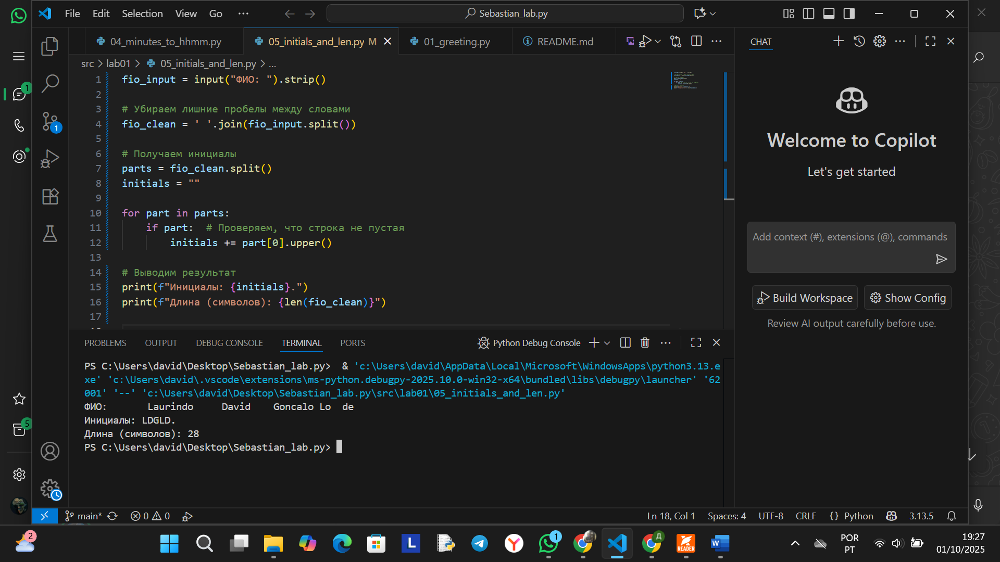

# ЛР1 -Ввод/Вывод и Форматирование
## Задание 01- Привет и возраст

## Задание 2 — Сумма и среднее

## Задание 3 — Чек: скидка и НДС

## Задание 4 — Минуты → ЧЧ:ММ

## Задание 5 — Инициалы и длина строки

